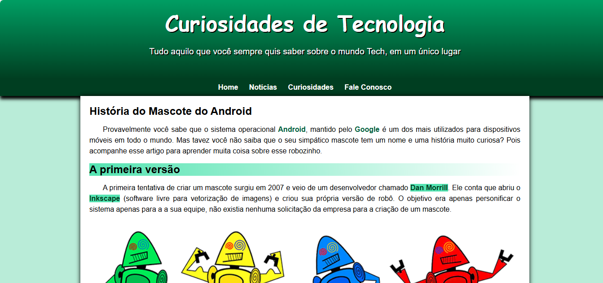

# 🤖 Curiosidades de Tecnologia

Um site simples em HTML e CSS que explora as curiosidades do mundo da tecnologia, com foco na história do mascote Android.

## 📂 Conteúdo

Este projeto consiste nos seguintes arquivos:

* `index.html`: 📄 A estrutura principal do site em HTML.
* `style.css`: 🎨 A folha de estilos CSS para a apresentação visual do site.
* `imagens/`: 🖼️ Diretório contendo as imagens utilizadas no site.
    * `dan-droids.png`: Imagem do primeiro mascote do Android.
    * `dan-droids-pq.png`: Versão menor da imagem do primeiro mascote do Android.
    * `irina-blok.jpg`: Foto da criadora do Bugdroid, Irina Blok.
    * `irina-blok-pq.jpg`: Versão menor da foto de Irina Blok.
    * `bugdroid.png`: Imagem do mascote atual do Android, Bugdroid.
    * `favicon.ico`: 🌐 Ícone exibido na aba do navegador.

## 🚀 Como Executar

Para visualizar este site, basta abrir o arquivo `index.html` no seu navegador web preferido. Não é necessário nenhum servidor local.

## 🧐 O Que Você Vai Encontrar

Este site apresenta as seguintes seções:

* **Cabeçalho:** 📰 Título principal "Curiosidades de Tecnologia" e um subtítulo convidativo.
* **Navegação:** 🔗 Links para diferentes seções do site (Home, Notícias, Curiosidades, Fale Conosco).
* **Conteúdo Principal:** 📜 Um artigo detalhado sobre a história do mascote do Android, incluindo:
    * A primeira tentativa de mascote criada por Dan Morrill.
    * O surgimento do Bugdroid, criado por Irina Blok.
    * Uma seção "Quer aprender mais?" com uma lista das versões do Android nomeadas em homenagem a doces.
* **Rodapé:** ©️ Informações sobre o criador do site.

## 🎨 Estilos e Design

O design do site é construído utilizando CSS, com as seguintes características principais:

* Paleta de cores inspirada no tema Android, com tons de verde.
* Fontes personalizadas para títulos e texto principal.
* Layout responsivo, adaptando-se a diferentes tamanhos de tela (desktop e mobile).
* Efeitos visuais sutis, como gradientes e sombras.

## 🖼️ Imagens

Todas as imagens utilizadas neste projeto estão localizadas no diretório `imagens/`. As imagens principais possuem uma versão menor (`-pq.png` ou `-pq.jpg`) para otimizar o carregamento em dispositivos com telas menores.

## 🔗 Links Externos

O artigo contém links para as seguintes páginas externas:

* [Dan Morrill shows us the Android mascot that almost was](https://androidcommunity.com/dan-morrill-shows-us-the-android-mascot-that-almost-was-20130103/)
* [Inkscape](https://inkscape.org/pt-br/)
* [Irina Blok](https://www.irinablok.com/android)
* [Android History](https://www.android.com/)

## 🛠️ Tecnologias Utilizadas

* **HTML5:** 🏗️ Para a estrutura do conteúdo web.
* **CSS3:** 🎨 Para a estilização e o layout da página.

## 👤 Autor

* **Uberdan Almeida**

## 📄 Licença

Este projeto está sob a licença [MIT](https://opensource.org/licenses/MIT). Sinta-se à vontade para usar e modificar o código como desejar.